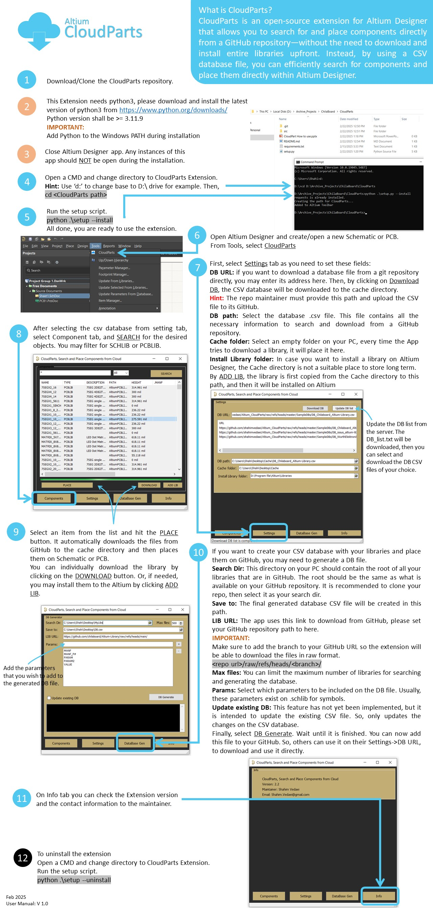

**1. Requirements:**
- Python 3
    - Downlaod python 3 from the upstream and install
    - Make sure python is added to the system PATH.
    - Ref: https://www.python.org/downloads/
- Altium Designer
    - The script will run under Altium Designer, so it is required to have the app installed.

**2. How to install:**
- Open a cmd and cd to the CloudParts folder
    - cd <path to CloudParts>
- Install the Extention
    - python .\setup.py --install

**3. How to uninstall:**
- Open a cmd and cd to the CloudParts folder
    - cd <path to CloudParts>
- Uninstall the Extention
    - python .\setup.py --uninstall

**4. Usage:**
- Open a schematic or PCB document on Altium Designer
- Tools->CloudParts

**5. Issues and fixes:**
- Libraries will not be updated:
    - Check if your PC has internet access and the download URL is valid.
    - Check if python is added to the Windows PATH. To verify, open a CMD and type python, then enter. Does it open the python?
    - Uninstall the old python, and install the latest version of python

Shahim Vedaei
<shahim.vedaei@gmail.com>

